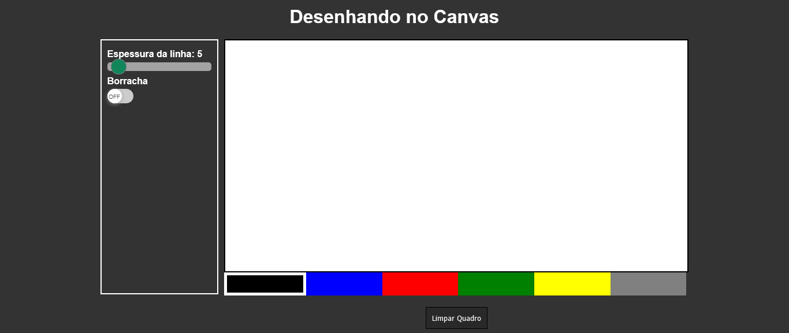

# Desenho utilizando o Canvas
Projeto feito no evento 7 Projetos JavaScript feito pela B7Web. Consiste numa aplicação que disponibiliza uma tela para desenhar, algumas cores e opções para espessura da linha e borracha.

:globe_with_meridians: [Site](https://caducoder.github.io/desenhando-no-canvas/)

## Tecnologias
- HTML5
- CSS3
- JavaScript

## Funcionalidades
<<<<<<< HEAD
 :white_check_mark: Limpar Tela  
 :white_check_mark: Alterar espessura da linha  
 :white_check_mark: Adicionar borracha  
=======
 :white_check_mark: Limpar Tela
 :white_check_mark: Alterar espessura da linha
 :white_check_mark: Adicionar borracha
>>>>>>> d1b652ebce511964c8de8f34d8de0d9f9451581d
:white_large_square: Mudar ícone do cursor da borracha